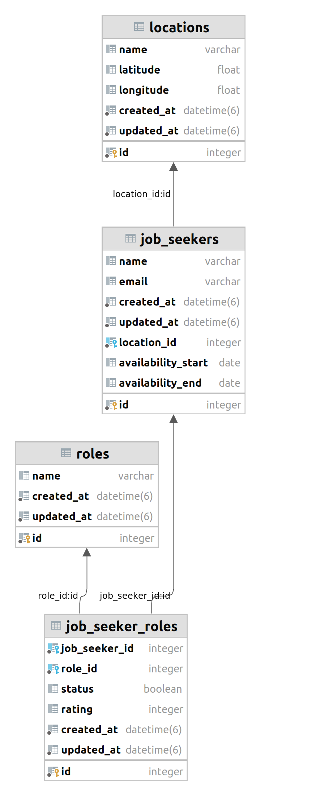

# Programming Exercise

### **Purpose:**

Create an efficient system to find and rank job applicants who are qualified for a specific role at a designated location and time, focusing on optimizing data handling and query performance.

See the full description here: https://wolfxyz.notion.site/Engineering-Task-Data-Modeling-Job-Seeker-c64b5388573349ebb8acf84ef2c3de74

The models associated with the problem were created and are shown in the following diagram:



### Running Tests
This project uses RSpec for testing. To run the tests, follow these steps:

1 - Navigate to the project directory (if you are not already there).

2 - Run the RSpec tests:

```
bundle exec rspec
```